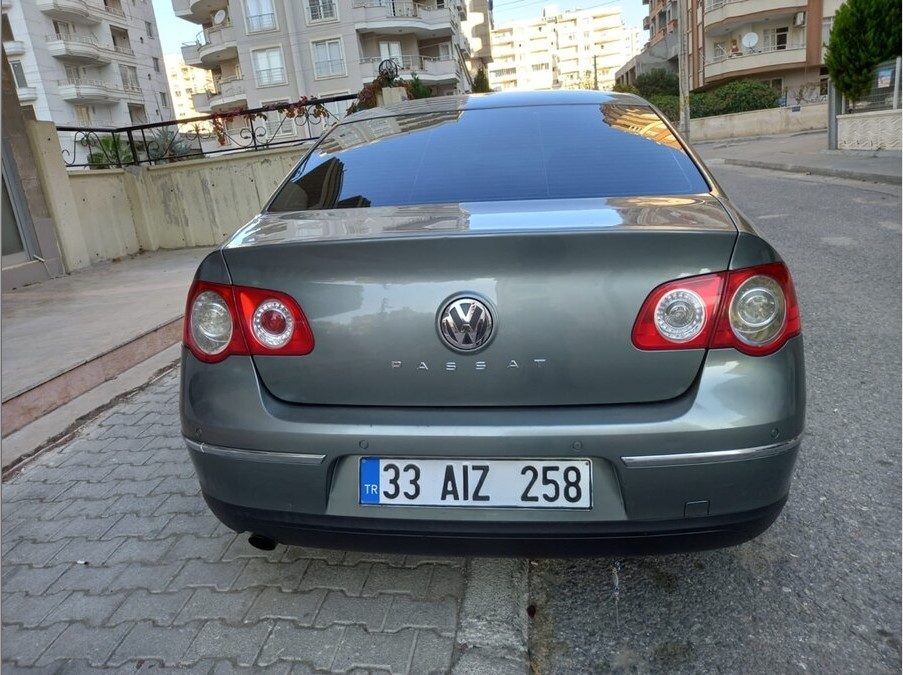

# Wykrywanie tablic rejestracyjnych na zdjęciach samochodów

# Wstęp

Celem projektu jest stworzenie oprogramowania pozwalającego na wykrycie
europejskiej tablicy rejestracyjnej zwyczajnej jednorzędowej. Na projekt
zostały nałożone następujące wymagania: Formatem wejściowym oraz
wyjściowym dla programów powinny być obrazki w formacie PPM lub PGM.
Kod w C. Bez użycia zewnętrznych bibliotek. Demonstracja działania
programu na płycie Raspberry PI 3 w trakcie zajęć.

# Wykorzystane oprogramowanie

Do stworzenia projektu użyto edytora Visual Studio Code w wersji 1.68
oraz kompilatora gcc version 9.2.0 (GCC). Do podglądu zdjęć w formacie
ppm użyto IrfanViev, natomiast to podglądu binarnych wartości plików
użyto Notepad++ wraz z pluginem Hexeditor.

# Użyte algorytmy

W celu detekcji tablic użyo następujące algorytmy:

1.  Przekształcenie obrazu na skalę szarości poprzez wyciągnięcie
    średniej ze składowych R G B,

2.  Normalizacja histogramu zgodnie z algorytmem 5.1 z zajęć,

3.  Binaryzacja obrazu poprzez metodę Otsu, oraz przez stałą wartość
    progową,

4.  Konwolucja obrazu,

5.  Detekcja krawędzi przy pomocy operatora Sobel,

6.  Modyfikacja obrazu poprzez dylatację,

7.  Wykrywanie skupisk - Blob detection algorythm,

# Sposób działania

Parametrem wejściowym programu jest obraz w formacie ppm o wymiarach
zbliżonym do 500 na 500. Zdjęcie takie może zostać pozyskane w
internecie, zmniejszone do porządnego wymiaru, oraz przekonwertowane na
format ppm. Ważnym elementem jest usunięcie wszelkich komentarzy w pliku
ppm, które niektóre internetowe konwertery dodają do nagłówka zdjęcia.

Kolejnym etapem jest stworzenie kopii tego zdjęcia w skali szarości.
Uzyskujemy to poprzez wyciągniecie średniej wartości składowych R G B
wchodzących w skład jednego pixela. Zdjęcie to następnie jest zapisywane
pod nazwą grayscaled.ppm.

![Zdjęcie w skali szarości]

Po wykonaniu tej czynności, dokonujemy wyrównania histogramu, a
następnie binaryzujemy nasz obraz. Na początku, do tego celu używaliśmy
algorytmu Otsu, jednak w trakcie testów okazało się, że sztywna wartość
wykazywała lepsze rezultaty. Zdjęcie po binaryzacji zapisywane jest jako
tresholded.pgm

![Obraz po binearyzacji]

Po wykonaniu binearyzacji, przechodzimy do wykrywania krawędzi przy
użyciu operatora sobla. Obraz wynikowy zapisywany jest jako edge.pgm.

![Wykryte krawędzie]

Następnie wykonujemy dylatację obrazu. Powtarzamy ten etap kilka razy
aby wykryte krawędzie utworzyły skupisko białych pikseli. W naszych
testach odpowiednia ilość powtórzeń wynosi co najmniej 6. Obraz po
dylatacji zapisywany jest jako dialeted.pgm.

![6 krotna dylatacja]

Ostatnim etapem jest detekcja tak zwanych blobów, oraz wycięcie
interesującego nasz obszaru. Etap ten polega on obliczaniu odległości
białych pikseli od wcześniej znalezionych już skupisk. Jeżeli ich
odległość jest mniejsza niż zadany treshold ( 94 piksele), piksel
dołączany jest to wcześniej znalezionego już bloba. Po przebadaniu
całego obszaru, szukamy takiego bloba, który swoimi proporcjami
przypomina tablice rejestracyjną (4.5 długości do 1 wysokości) i wycina
ten obszar. Etap ten jest najbardziej czuły na zakłócenia, dlatego jego
sprawność jest narażona na niedopatrzenia wynikające ze wcześniejszych
kroków. Zlokalizowana tablica zapisywana jest jako crop.pgm.

![Zlokalizowana i wycięta tablica.]

# Pomysły na rozwój

Zmianami które wymagają przepadania jest detekcja krawędzi. Operator
sobla działa poprawnie, jednak rodzi się pytanie czy użycie de tego celu
algorytmu canny’ego nie będzie lepszym rozwiązaniem. Ze względu na dobre
wyniki, pierwsza wersja projektu pozostaje przy operatorze sobla.
Kolejnym polem do poprawy jest detekcja blobów. Potencjalnie lepszym
rozwiązaniem było by wykrywanie zamkniętych obszarów, a następnie ich
filtracja na podstawie rozmiaru, położenia, proporcji. Ze względu na
złożoność algorytmu wykrywania takich obszarów (Connected Component
Labeling) pozostano przy detekcji blobów.

